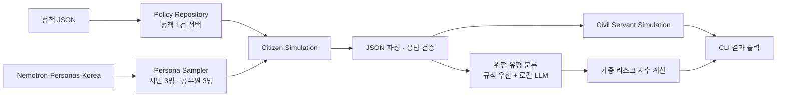
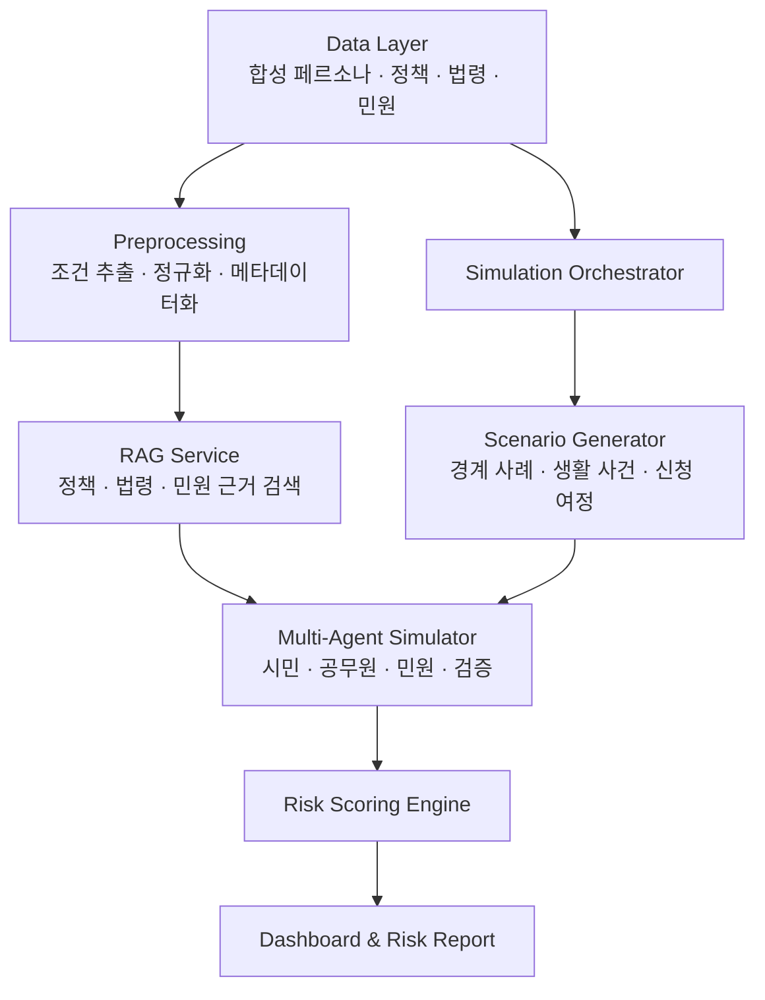

<div align="center">

# Policy Risk Persona Simulator

### Nemotron 기반 정책 사각지대·민원 리스크 사전 시뮬레이터


정책이 시행되기 전에 다양한 합성 시민 페르소나가 정책을 어떻게 이해하고 경험할지 시뮬레이션하여,
**정책 사각지대·신청 마찰·형평성 논란·민원 발생 가능성**을 조기에 탐색하는 오픈소스 지향 프로젝트입니다.

**2026 오픈소스 개발자대회 자유과제 출품 프로젝트**

</div>

> [!IMPORTANT]
> 이 저장소는 개발 중인 MVP입니다. 현재 구현은 CLI 기반 시뮬레이션 파이프라인이며, 문서 업로드·RAG·대시보드 등은 단계적으로 연결하고 있습니다. 모듈 경계, 모델, 데이터 저장 방식 및 전체 아키텍처는 구현·검증 결과에 따라 변경될 수 있습니다.

> [!CAUTION]
> 본 프로젝트의 결과는 정책 검토를 지원하기 위한 **가상 시뮬레이션 결과**입니다. 실제 수급 자격, 법률 해석, 행정 처분 또는 특정 집단의 실제 의견을 확정적으로 나타내지 않습니다.

## 목차

- [프로젝트 개요](#프로젝트-개요)
- [문제 정의](#문제-정의)
- [핵심 기능](#핵심-기능)
- [현재 구현 범위](#현재-구현-범위)
- [실행 흐름](#실행-흐름)
- [민원 리스크 산정](#민원-리스크-산정)
- [설치 및 실행](#설치-및-실행)
- [데이터](#데이터)
- [프로젝트 구조](#프로젝트-구조)
- [기술 스택](#기술-스택)
- [로드맵](#로드맵)
- [오픈소스 및 라이선스](#오픈소스-및-라이선스)
- [팀](#팀)

---

## 프로젝트 개요

정책안, 조례안, 지원사업 공고문, 행정 안내문은 같은 내용이라도 시민의 연령, 지역, 직업, 소득 형태, 가족 구성, 장애 여부, 이동 가능성 및 디지털 역량에 따라 다르게 받아들여질 수 있습니다.

이 프로젝트는 한국형 합성 페르소나와 로컬 오픈웨이트 LLM을 이용해 정책을 사전에 테스트합니다. 시민 페르소나는 정책을 읽고 예상 문의·불만·신청 장애를 생성하며, 공무원 페르소나는 해당 민원에 대응합니다. 이후 규칙과 로컬 LLM을 결합한 분류기가 민원을 위험 유형으로 분류하고 정책 단위 리스크 지수를 계산합니다.

### 목표

1. 정책 시행 전에 누락된 대상과 경계 사례를 발견합니다.
2. 어려운 안내 문구, 복잡한 서류, 온라인 전용 절차 등 신청 마찰을 탐지합니다.
3. 반복 민원과 형평성 논란이 예상되는 조건을 사전에 식별합니다.
4. 정책 담당자가 문제 문장과 근거를 확인하고 개선안을 검토할 수 있게 합니다.
5. 합성 페르소나와 공개 데이터를 사용하여 개인정보 의존도를 낮춥니다.
6. 정책 외에도 교육, 공공 서비스, 기업 UX 등으로 확장 가능한 시뮬레이션 프레임워크를 지향합니다.

---

## 문제 정의

기존 민원 분석은 이미 접수된 민원을 분류·집계하는 **사후 분석**에 강점이 있습니다. 그러나 정책 시행 전에는 다음과 같은 위험을 충분히 검증하기 어렵습니다.

- 지원 대상과 제외 조건이 모호해 스스로 자격을 판단하기 어려운 경우
- 소득 형태나 가족 구성 등 현실의 다양한 경계 사례가 누락된 경우
- 제출 서류, 본인 인증, 방문 제출 등 절차적 부담이 큰 경우
- 온라인 신청만 제공되어 디지털 취약 계층이 배제되는 경우
- 지역별 교통·기관 접근성 차이가 정책 이용 가능성에 영향을 주는 경우
- 행정 용어와 안내 문장이 복잡해 반복 문의가 발생하는 경우

본 프로젝트는 실제 개인정보가 아닌 합성 시민 집단을 대상으로 정책을 반복 시뮬레이션하여, 이러한 위험을 **정책 시행 전**에 탐색합니다.

---

## 핵심 기능

### 현재 동작하는 기능

- **합성 페르소나 자동 준비**: `nvidia/Nemotron-Personas-Korea`의 Parquet 데이터를 최초 실행 시 내려받습니다.
- **페르소나 표본 추출**: 직업·연령 조건에 따라 시민 및 공무원 페르소나를 추출합니다.
- **로컬 LLM 추론**: `Qwen/Qwen3-4B-Instruct-2507`을 로컬에서 로드하여 외부 상용 API 없이 응답을 생성합니다.
- **시민 시뮬레이션**: 시민 관점의 예상 민원과 대화 내용을 구조화된 JSON으로 생성하고 검증합니다.
- **공무원 응답 시뮬레이션**: 시민 민원을 정책 및 공무원 페르소나와 함께 입력하여 행정 응답을 생성합니다.
- **하이브리드 민원 분류**: 키워드 규칙을 우선 적용하고, 분류되지 않은 민원은 로컬 LLM으로 보완합니다.
- **정책 리스크 지수 산출**: 페르소나별 위험 유형 발생률과 YAML 가중치를 이용해 정책 단위 지수를 계산합니다.
- **CLI 결과 출력**: 시민 응답, 공무원 응답, 위험 유형별 발생률 및 최종 지수를 터미널에 출력합니다.

### 목표 기능

- PDF·DOCX·TXT·Markdown 정책 문서 업로드
- 지원 대상, 제외 조건, 기간, 서류, 신청 방식 자동 추출
- 정책·법령·민원 근거를 연결하는 RAG
- 경계 대상 및 예외 조건을 탐색하는 시나리오 생성기
- 시민·공무원·민원·검증 에이전트 기반 다중 에이전트 시뮬레이션
- 문제 문장 하이라이트와 근거 문서 연결
- 리스크 히트맵, 예상 민원 Top 5, 개선 전·후 비교 대시보드
- 정책 개선안 및 FAQ 초안 생성
- 법률 리스크 시뮬레이션

---

## 현재 구현 범위

| 영역 | 현재 MVP | 목표 상태 |
|---|---|---|
| 정책 입력 | 저장된 정책 JSON 중 1건을 무작위 선택 | 사용자가 정책 문서를 업로드하거나 직접 입력 |
| 페르소나 | 시민 3명·공무원 3명을 무작위 표본 추출 | 조건·지역·집단별 코호트 구성 및 KOSIS 기반 보정 |
| 시뮬레이션 | 시민 민원 생성 → 공무원 응답 | 시나리오 생성기와 검증 에이전트를 포함한 다중 에이전트 실행 |
| 근거 검색 | 미연결 | 정책·법령·과거 민원 RAG 및 근거 검증 |
| 분류 | 키워드 규칙 + 로컬 LLM | 규칙·모델·통계 검증을 결합한 분류기 |
| 스코어링 | 8개 위험 유형의 초기 가중치 기반 지수 | 실증 데이터 보정, 신뢰구간 및 설명 가능한 세부 점수 |
| 사용자 인터페이스 | CLI JSON 출력 | 웹 대시보드와 다운로드 가능한 리포트 |

---

## 실행 흐름



### 목표 아키텍처



---

## 민원 리스크 산정

### 분류 방식

1. 민원 문장에서 사전에 정의한 키워드를 탐색합니다.
2. 하나 이상의 규칙이 일치하면 가장 많이 일치한 위험 유형을 선택합니다.
3. 규칙으로 분류되지 않으면 현재 로컬 Qwen 모델에 8개 유형 중 하나를 선택하도록 요청합니다.
4. 동일한 페르소나가 같은 위험 유형의 민원을 여러 건 생성해도 해당 유형의 발생 수는 한 번만 집계합니다.

### 현재 위험 유형과 초기 가중치

| ID | 위험 유형 | 설명 | 가중치 |
|---|---|---|---:|
| `target_ambiguous` | 대상 조건 모호 | 지원 대상인지 스스로 판단하기 어려움 | 0.15 |
| `access_barrier` | 신청 접근성 문제 | 온라인 전용, 방문 필수 등 접근 장벽 | 0.20 |
| `document_burden` | 서류 부담 | 제출 서류가 많거나 발급 절차가 복잡함 | 0.15 |
| `info_gap` | 정보 격차 | 행정 용어가 어렵고 설명이 부족함 | 0.10 |
| `equity_issue` | 형평성 논란 | 특정 계층이 이유 없이 제외된다고 느낄 가능성 | 0.15 |
| `regional_gap` | 지역 격차 | 도시·농어촌, 수도권·비수도권 간 접근 차이 | 0.10 |
| `digital_divide` | 디지털 취약 | 고령층·장애인 등의 디지털 접근 문제 | 0.10 |
| `complaint_surge` | 민원 폭증 가능 | FAQ 부족 등으로 반복 문의가 예상됨 | 0.05 |

현재 지수는 다음과 같이 계산합니다.

```text
category_rate(c)
  = 해당 위험 유형 c가 한 번 이상 발생한 페르소나 수 / 전체 페르소나 수

risk_index
  = Σ weight(c) × category_rate(c)
```

현재 가중치의 합은 `1.0`이며, 지수 범위도 원칙적으로 `0.0 ~ 1.0`입니다. 가중치는 초기 설계값으로, 향후 KOSIS 통계·전문가 검토·실제 민원 데이터에 따라 보정할 예정입니다.

### 출력 스키마 예시

```json
{
  "index": 0.0,
  "rate_by_category": {
    "target_ambiguous": 0.0,
    "access_barrier": 0.0,
    "document_burden": 0.0,
    "info_gap": 0.0,
    "equity_issue": 0.0,
    "regional_gap": 0.0,
    "digital_divide": 0.0,
    "complaint_surge": 0.0
  },
  "n_personas": 3
}
```

---

## 설치 및 실행

### 1. 요구 사항

- Python `3.12` 이상
- Git 및 Git LFS
- 최초 실행 시 모델과 페르소나 데이터셋을 내려받을 수 있는 네트워크
- 로컬 모델을 실행할 수 있는 충분한 저장 공간과 메모리
- CUDA GPU 또는 Apple Silicon MPS 권장
  - CPU에서도 실행 경로는 제공하지만 추론 시간이 크게 늘어날 수 있습니다.
  - 현재 4B 모델을 양자화 없이 로드하므로 장치의 RAM/VRAM 사용량이 클 수 있습니다.

### 2. 저장소 복제

```bash
git lfs install
git clone https://github.com/dev-samuel-codes/policy_risk_persona_simulator.git
cd policy_risk_persona_simulator
git lfs pull
```

### 3. 가상환경 생성

#### macOS / Linux

```bash
python3.12 -m venv .venv
source .venv/bin/activate
```

#### Windows PowerShell

```powershell
py -3.12 -m venv .venv
.\.venv\Scripts\Activate.ps1
```

### 4. 의존성 설치

```bash
python -m pip install --upgrade pip
python -m pip install -e .
```

현재 실행에 필수인 환경 변수는 없습니다.

### 5. 시뮬레이션 실행

저장소 루트에서 실행합니다.

```bash
python -m backend.main
```

최초 실행에서는 다음 작업이 자동으로 수행됩니다.

1. Hugging Face에서 Nemotron 페르소나 Parquet 파일 다운로드
2. Hugging Face 모델 캐시에 Qwen 모델 다운로드
3. 시민·공무원 페르소나 표본 추출
4. 정책 1건 무작위 선택
5. 시민 민원 및 공무원 응답 생성
6. 민원 분류와 정책 리스크 지수 계산

### 정책 JSON 보조 입력 도구

루트의 `policy_json_converter.py`는 정책 필드를 터미널에서 입력받아 JSON을 출력하는 독립 보조 도구입니다.

```bash
python policy_json_converter.py
```

> [!NOTE]
> 이 도구의 출력은 아직 메인 파이프라인에 자동 연결되지 않습니다. 현재 메인 파이프라인은 `data/raw/policies`의 사전 가공 정책 데이터를 사용합니다.

---

## 데이터

### 현재 파이프라인에서 사용하는 데이터

| 데이터 | 용도 | 저장/수집 방식 |
|---|---|---|
| `nvidia/Nemotron-Personas-Korea` | 시민·공무원 합성 페르소나 | 최초 실행 시 Hugging Face에서 자동 다운로드 |
| 정책 서비스 목록 | 분석 대상 정책 선택 | `data/raw/policies/service_list.json` |
| 정책 상세 정보 | 서비스명·내용 등 정책 맥락 | `data/raw/policies/service_detail.json` |
| 지원 조건 | 대상 및 지원 조건 | `data/raw/policies/support_conditions.json` |

페르소나 데이터는 `data/raw/personas/*.parquet`에 저장되며, 다운로드 완료 마커가 있으면 재다운로드를 건너뜁니다. 해당 디렉터리는 Git 추적 대상에서 제외됩니다.

### 수집·연동 예정 데이터

팀 내부 수집 현황 기준으로 다음 자산을 준비하고 있습니다. 아래 데이터가 모두 현재 실행 파이프라인에 연결된 것은 아닙니다.

- 정책 데이터 약 10,966건
- 정책 관련 민원 약 2,000건
- 청원 보충 데이터 CSV
- 법령 데이터 약 5,596건 XML
- KOSIS 및 공공데이터 기반 인구 분포·지역 통계
- 국민신문고·국민권익위원회 등 민원 데이터

### 데이터 원칙

- 데이터별 원 출처, 이용 조건, 재배포 가능 범위를 확인합니다.
- 민원 데이터는 개인정보 포함 여부를 확인하고 필요한 경우 비식별화합니다.
- 정책·법령 데이터는 기준일과 개정 여부를 메타데이터로 관리합니다.
- 합성 페르소나 분포는 실제 인구 분포와 동일하다고 가정하지 않으며, 향후 KOSIS 비율을 이용해 보정합니다.
- 모델·데이터 라이선스는 팀 작성 코드의 라이선스와 별도로 관리합니다.

---

## 프로젝트 구조

현재 핵심 실행 경로를 중심으로 정리한 구조입니다. 개발 과정에서 변경될 수 있습니다.

```text
.
├── backend/
│   ├── main.py
│   ├── ai_simulation_core/
│   │   ├── pipeline.py
│   │   ├── llm/
│   │   │   ├── llm_gateway.py
│   │   │   └── qwen_model.py
│   │   ├── personas/
│   │   │   ├── persona_downloader.py
│   │   │   └── persona_sampler.py
│   │   ├── policies/
│   │   │   └── policy_repository.py
│   │   ├── prompts/
│   │   │   ├── citizen_prompt.py
│   │   │   └── civil_servant_prompt.py
│   │   └── simulations/
│   │       ├── citizen_simulation.py
│   │       └── civil_servant_simulation.py
│   └── scoring/
│       ├── risk_classifier.py
│       ├── risk_keywords.py
│       └── risk_scorer.py
├── config/
│   └── civil_complaint_risk.yaml
├── data/
│   └── raw/
│       ├── policies/
│       └── personas/              # 실행 중 자동 생성, Git 제외
├── policy_json_converter.py
├── pyproject.toml
└── README.md
```

---

## 기술 스택

### 현재 구현

| 영역 | 기술 |
|---|---|
| 언어 | Python 3.12+ |
| 로컬 LLM | Qwen3 4B Instruct |
| 모델 실행 | PyTorch, Transformers, Accelerate |
| 모델·데이터 허브 | Hugging Face Hub |
| 페르소나 처리 | Pandas, PyArrow |
| 설정 | YAML |
| 품질 도구 | Ruff 설정 포함 |

`pyproject.toml`의 현재 주요 의존성은 다음과 같습니다.

- `torch==2.12.1`
- `transformers==5.12.1`
- `accelerate==1.14.0`
- `huggingface-hub==1.21.0`
- `pandas==3.0.3`
- `pyarrow==24.0.0`
- `pyyaml>=6.0,<7`
- `safetensors==0.8.0`
- `sentencepiece==0.2.1`

### 목표 아키텍처의 기술 후보

아래 항목은 확정 스택이 아니라 구현 후보입니다.

- API: FastAPI
- RAG·검색: ChromaDB 또는 FAISS, LangChain 또는 LlamaIndex
- 저장소: PostgreSQL 및 Vector DB
- 프론트엔드: React, Vite, Tailwind CSS
- 시각화: Recharts, Plotly 또는 D3.js
- 문서 파싱: PyMuPDF, pdfplumber, python-docx
- 스키마 검증: Pydantic 또는 JSON Schema

---

## 로드맵

### 1차 MVP — 기본 시뮬레이션

- [x] 로컬 LLM 로딩
- [x] 합성 페르소나 자동 다운로드
- [x] 시민·공무원 페르소나 추출
- [x] 시민 민원 생성
- [x] 공무원 응답 생성
- [x] 8개 유형 민원 분류
- [x] 정책 단위 리스크 지수 계산
- [ ] 사용자가 입력한 정책을 메인 파이프라인에 연결

### 2차 MVP — 근거 기반 분석

- [ ] 정책·민원 문서 전처리
- [ ] RAG 검색 서비스
- [ ] 검색 근거 누락·환각 검증
- [ ] 문제 문장과 과거 민원 근거 연결
- [ ] 스코어링 실증 보정
- [ ] 정책 개선안 생성

### 3차 MVP — 서비스화 및 확장

- [ ] 정책 문서 업로드 API
- [ ] 웹 대시보드와 리포트
- [ ] 시뮬레이션 작업 상태 관리
- [ ] 법률 리스크 시뮬레이션
- [ ] 지역·복지·교육 등 도메인별 페르소나 팩
- [ ] 재현 가능한 평가 데이터셋 및 테스트 자동화

---

## 오픈소스 및 라이선스

> [!WARNING]
> 현재 저장소에는 명시적인 `LICENSE` 파일이 없습니다. 라이선스가 추가되기 전에는 저장소가 공개되어 있더라도 코드의 사용·수정·재배포 권한이 자동으로 부여되는 것으로 간주해서는 안 됩니다.

대회 제출 전 다음 작업이 필요합니다.

- [ ] 팀이 직접 작성한 코드에 OSI 승인 오픈소스 라이선스 적용
- [ ] 저장소 루트에 `LICENSE` 추가
- [ ] `THIRD_PARTY_NOTICES.md` 또는 동등한 문서에 라이브러리·모델·데이터 출처와 라이선스 정리
- [ ] Qwen 모델 카드의 이용·재배포 조건 확인
- [ ] Nemotron 페르소나 데이터셋의 라이선스 및 표시 의무 확인
- [ ] 정책·민원·청원·법령 데이터의 출처와 재배포 가능 범위 확인
- [ ] 공개 저장소에 포함하면 안 되는 개인정보·비공개 원문 제거

2026 오픈소스 개발자대회 규정상 팀 작성 코드는 OSI 인증 라이선스를 적용해야 하며, AI 모델은 최소 오픈웨이트 수준의 공개 모델을 사용해야 합니다. 최종 라이선스는 모델·데이터·의존 라이브러리의 조건을 함께 검토한 뒤 확정합니다.

---

## 기여 방법

현재는 대회 팀 중심으로 개발하고 있습니다. 제안 또는 오류를 발견한 경우 GitHub Issue에 다음 내용을 포함해 주세요.

1. 재현 환경과 실행 명령
2. 사용한 정책 데이터 또는 최소 재현 입력
3. 실제 결과와 기대 결과
4. 로그 또는 오류 메시지
5. 개인정보와 민감정보를 제거한 예시

코드 변경은 작은 단위의 브랜치와 Pull Request로 제출하고, 아키텍처 변경 시 해당 문서와 실행 방법도 함께 갱신합니다.

---

## 팀

| 이름 | 역할 |
|---|---|
| 최사무엘 | 팀장 |
| 김초은 | 팀원 |
| 박초이 | 팀원 |

---

## 참고 및 감사

- [NVIDIA Nemotron-Personas-Korea](https://huggingface.co/datasets/nvidia/Nemotron-Personas-Korea)
- [Qwen3-4B-Instruct-2507](https://huggingface.co/Qwen/Qwen3-4B-Instruct-2507)
- [청와대 국민청원 데이터](https://github.com/akngs/petitions)
- KOSIS 국가통계포털
- 정부24, 복지로 및 지방자치단체 정책 자료
- 국가법령정보센터
- 국민신문고 및 국민권익위원회 공개 자료

---

<div align="center">

**정책을 배포하기 전에, 시민의 관점에서 먼저 실행해 봅니다.**

</div>
