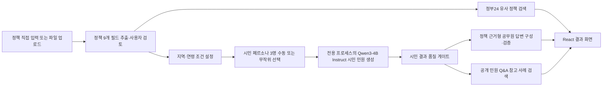

<div align="center">

# CivicEcho

### 정책 시행 전에 합성 시민 페르소나로 예상 민원과 정책 사각지대를 검토하는 로컬 AI 시뮬레이터


**정책 입력 또는 문서 업로드 → 지역·연령 조건 설정 → 시민 페르소나 3명 선택 → 예상 민원·공무원 답변·유사 사례 확인**

</div>

## 대회 및 프로젝트 정보

| 항목 | 내용 |
|---|---|
| 대회 | 2026년 오픈소스 개발자대회 |
| 참가 부문 | 학생 |
| 과제 유형 | 자유과제 |
| 팀명·인원 | CivicEcho·3명 |
| 대회 제출 프로젝트명 | 페르소나 네모트론 기반 정책 민원 예측 시뮬레이터 (CivicEcho) |
| 공개 저장소 | `dev-samuel-codes/policy_risk_persona_simulator` |
| AI 활용 유형 | 외부 공개 모델을 추가 학습 없이 연동·구동하는 유형 1 |

## 목차

- [프로젝트 개요](#프로젝트-개요)
- [목표와 설계 원칙](#목표와-설계-원칙)
- [차별성](#차별성)
- [현재 구현 범위](#현재-구현-범위)
- [동작 구조](#동작-구조)
- [현재 데이터 스냅샷](#현재-데이터-스냅샷)
- [AI 모델과 데이터 사용 방식](#ai-모델과-데이터-사용-방식)
- [기술 스택](#기술-스택)
- [실행 요구사항](#실행-요구사항)
- [설치 및 실행](#설치-및-실행)
- [사용 방법](#사용-방법)
- [API](#api)
- [생성 결과 검증과 실패 처리](#생성-결과-검증과-실패-처리)
- [기대 효과와 활용 분야](#기대-효과와-활용-분야)
- [향후 계획](#향후-계획)
- [데이터 및 저장소 경계](#데이터-및-저장소-경계)
- [정책과 인덱스 갱신](#정책과-인덱스-갱신)
- [품질 검사](#품질-검사)
- [현재 한계](#현재-한계)
- [라이선스와 제3자 고지](#라이선스와-제3자-고지)

## 프로젝트 개요

기존 민원 분석은 이미 접수된 민원을 분류하고 집계하는 **사후 분석**에 강점이 있습니다. 그러나 정책 시행 전에는 다음과 같은 문제를 충분히 검토하기 어렵습니다.

- 지원 대상과 제외 조건이 모호해 시민이 자격을 스스로 판단하기 어려운 경우
- 신청 기간, 제출 서류, 신청 채널 또는 문의처가 충분히 설명되지 않은 경우
- 디지털 전용 신청 절차나 방문 제출이 특정 시민에게 장벽이 되는 경우
- 지역별 교통·기관 접근성 차이가 정책 이용 가능성에 영향을 주는 경우
- 연령 경계 바로 밖의 시민이 형평성 문제를 제기할 수 있는 경우
- 정책 문구에 근거하지 않은 답변이 행정 안내처럼 제시되는 경우

CivicEcho는 정책을 다양한 지역·연령·직업·생활 배경의 합성 시민에게 미리 적용하여 예상 문의, 불만, 신청 장애와 정책 사각지대를 탐색합니다. 정책 담당자는 **정책 원문, 선택한 시민 페르소나, 생성된 민원, 공무원 답변, 유사 정책, 공개 민원 Q&A 참고 사례**를 하나의 결과 화면에서 연결해 검토할 수 있습니다.

## 목표와 설계 원칙

| 원칙 | 적용 방식 |
|---|---|
| 시행 전 사전 점검 | 접수된 민원을 사후 집계하는 대신 정책 초안을 합성 시민에게 먼저 적용 |
| 개인정보 의존 최소화 | 실제 시민 개인정보 대신 `nvidia/Nemotron-Personas-Korea` 합성 페르소나 사용 |
| 외부 상용 AI API 의존 최소화 | 생성과 임베딩을 로컬 공개 모델로 수행 |
| 서버 측 조건 강제 | 지역·연령 조건, 중복 ID, 공무원 직군 제외 등을 백엔드에서 다시 검증 |
| 경계 사례 분리 | 정책 연령 하한보다 1세 낮거나 상한보다 1세 높은 시민을 별도 경계 코호트로 조회 |
| 생성과 검색 근거 분리 | LLM 생성 결과와 정부24·공개 FAQ 검색 자료를 별도 필드와 상태로 제공 |
| 부분 성공 차단 | 시민 또는 공무원 결과 하나라도 최종 검증에 실패하면 전체 작업을 실패 처리 |
| 해석 범위 명시 | 실제 의견·발생확률·자격 확정으로 오해하지 않도록 제품 범위와 한계를 표시 |

정량적인 제품 단위는 **정책 1건당 시민 페르소나 3명과 연결된 공무원 응답 3개**입니다. 각 시민은 현재 생성 계약에 따라 미리 정한 단일 쟁점의 민원 1개를 생성합니다.

## 차별성

| 구분 | 일반적인 사후 민원 분석 | CivicEcho |
|---|---|---|
| 분석 시점 | 정책 시행 후 | 정책 시행 전 |
| 입력 | 이미 접수된 민원 | 정책 초안·공고문·행정 안내문 |
| 분석 단위 | 집계 통계와 분류 | 조건이 다른 합성 시민의 구체적 대화와 신청 장애 |
| 조건 처리 | 수집된 민원 메타데이터 의존 | 지역·연령 조건을 서버에서 강제하고 경계 코호트를 분리 |
| 근거 | 과거 민원 데이터 | 입력 정책 원문, 정부24 유사 정책, 공개 민원 Q&A 참고 사례 |
| 결과 통과 기준 | 분석 결과 집계 | 시민·공무원 결과의 구조·근거·페르소나 정합성 품질 게이트 |
| 개인정보 | 실제 민원에 포함될 수 있음 | 합성 페르소나 중심 |

## 현재 구현 범위

| 기능 | 상태 | 현재 구현 |
|---|---:|---|
| 정책 입력 | ✅ | 정책 직접 입력 또는 PDF·DOCX·HWPX·TXT·MD 업로드 |
| 정책 필드 추출 | ✅ | 로컬 Qwen이 정책명, 대상, 기간, 혜택, 제외 조건 등 9개 필드를 추출하고 사용자가 수정 |
| 페르소나 후보 조회 | ✅ | 전국 또는 시·도·시군구와 연령 조건으로 후보 조회 |
| 페르소나 선택 | ✅ | 조건 충족 후보 또는 연령 경계 1년 밖 후보에서 수동 3명 선택, 조건 충족 후보 무작위 3명 선택 |
| 시민 민원 생성 | ✅ | 선택한 시민마다 미리 정한 단일 쟁점의 민원 1개 생성 |
| 공무원 답변 | ✅ | 시민 민원과 정책 필드를 연결해 결정적으로 구성 |
| 품질 검증 | ✅ | 정책 근거, 지역·연령, 페르소나 사실, 숫자·신청 채널, 중복, JSON 구조 검증 |
| 유사 정책 검색 | ✅ | 정부24 정책 Chroma 인덱스에서 유사 정책 검색 |
| 공개 Q&A 참고 | ✅ | 공개 민원 FAQ Chroma 인덱스에서 조건을 통과한 참고 사례 검색 |
| 검색 상태 구분 | ✅ | `matched`, `no_reliable_match`, `invalid_query`, `unavailable` 상태 구분 |
| 비동기 작업 | ✅ | `queued`, `running`, `completed`, `failed` 상태와 JSON 작업 파일 |
| 웹 화면 | ✅ | 정책 입력, 페르소나 선택, 진행 화면, 시민·공무원 대화, 유사 정책·근거 패널 |
| 법령 분석·추천 | ❌ | 현재 제품 범위에서 제외 |
| 수치형 리스크 점수 | ❌ | 폐기된 프로토타입 기능이며 현재 결과 계약에 포함하지 않음 |
| 실제 모집단 대표성 평가 | ❌ | KOSIS 연계와 대표성 평가는 향후 계획 |
| 수정 전·후 비교·PDF 보고서 | ❌ | 향후 계획 |

## 동작 구조


```mermaid
flowchart LR
    A["정책 직접 입력 또는 파일 업로드"] --> B["정책 9개 필드 추출·사용자 검토"]
    B --> C["지역·연령 조건 설정"]
    C --> D["시민 페르소나 3명 수동 또는 무작위 선택"]
    B --> E["정부24 유사 정책 검색"]
    D --> F["전용 프로세스의 Qwen3-4B Instruct 시민 민원 생성"]
    F --> G["시민 결과 품질 게이트"]
    G --> H["정책 근거형 공무원 답변 구성·검증"]
    G --> I["공개 민원 Q&A 참고 사례 검색"]
    E --> J["React 결과 화면"]
    H --> J
    I --> J
```

실제 실행 순서는 다음과 같습니다.

1. 사용자가 정책을 직접 입력하거나 정책 문서를 업로드합니다.
2. 파일 입력이면 로컬 LLM이 9개 정책 필드를 추출하고, 사용자가 추출값을 검토·수정합니다.
3. 전국 또는 특정 지역과 최소·최대 연령을 지정합니다.
4. 조건을 충족하는 시민 또는 연령 하한·상한에서 정확히 1년 벗어난 경계 시민 중 3명을 선택합니다. 무작위 모드는 조건 충족 시민만 사용합니다.
5. FastAPI가 정책, 선택 조건과 페르소나 ID를 다시 검증하고 비동기 작업을 생성합니다.
6. Qwen3-4B Instruct가 시민마다 민원 1개를 생성하고, 서버가 정책·페르소나 근거를 검증합니다.
7. 서버가 같은 민원 쟁점을 정책 원문과 연결해 공무원 답변을 구성하고 다시 검증합니다.
8. 정부24 유사 정책과 공개 민원 Q&A 참고 사례를 연결합니다.
9. 시민 3명과 공무원 답변 3개가 모두 검증된 경우에만 완료 결과를 표시합니다.

## 현재 데이터 스냅샷

| 자산 | 기준 시점 | 규모·버전 | 용도 |
|---|---|---:|---|
| 정부24 대한민국 공공서비스(혜택) 정보 | 2026-08-25 수집 | 정책 10,961건 | 입력 정책과 유사한 정부 정책 검색 |
| 공개 민원 FAQ 스냅샷 | 2026-08-26 인덱스 생성 | 원본 2,168행, 식별자 기준 정규화 1,344건 | 생성 민원과 참고 가능한 공개 사례 연결 |
| Nemotron-Personas-Korea | 대회 결과보고서 및 최초 요청 시 다운로드 | Parquet 9개·1,000,000행, `refs/convert/parquet` | 시민·공무원 합성 페르소나 |
| 정책·민원 임베딩 | 현재 활성 인덱스 | `snunlp/KR-SBERT-V40K-klueNLI-augSTS`, 768차원, 최대 512토큰 | ChromaDB 의미 유사도 검색 |

정부24 정책과 공개 민원 Q&A는 모델 학습 데이터가 아니라 **검색 참고자료**로 사용합니다. 데이터 시점과 인덱스 건수는 저장소의 활성 manifest를 기준으로 하며, manifest의 시간값은 UTC입니다.

## AI 모델과 데이터 사용 방식

### 모델 활용 유형

- 외부 공개 모델을 추가 학습 없이 연동·구동하는 유형 1입니다.
- Qwen 생성 모델과 KR-SBERT 임베딩 모델은 원가중치를 그대로 사용합니다.
- 파인튜닝, 추가 학습 또는 팀이 새로 생성한 모델 가중치는 없습니다.
- 공개 저장소에 배포하는 팀 생성 가중치 파일도 없습니다.

### 현재 런타임 모델

| 역할 | 모델 | 현재 동작 |
|---|---|---|
| 시민 민원 생성·정책 파일 필드 추출 | `Qwen/Qwen3-4B-Instruct-2507` | `main`의 기본 생성 모델 |
| 정책·민원 임베딩 검색 | `snunlp/KR-SBERT-V40K-klueNLI-augSTS` | 768차원 임베딩과 Chroma 검색 |

> [!NOTE]
> 기본 모델은 `Qwen/Qwen3-4B-Instruct-2507`입니다. 다른 Qwen 모델로 교체할 때는 모델 상수와 장치별 메모리 설정을 함께 검증해야 합니다.

### 데이터와 개발 보조도구

- 추론용 합성 페르소나는 `nvidia/Nemotron-Personas-Korea`를 사용합니다.
- 정부24 정책과 공개 민원 Q&A는 검색 코퍼스로만 사용합니다.
- 정책 파일은 추론 단계에서 구조화하고 사용자가 검토·수정합니다.
- 실제 개인정보 대신 합성 페르소나를 사용합니다.
- Codex와 ChatGPT는 코드 작성 보조와 리팩터링에 활용되었으며, 제품 런타임의 시민·공무원 응답 생성은 로컬 Qwen이 담당합니다.

## 기술 스택

| 영역 | 기술 |
|---|---|
| 백엔드 | Python 3.12 이상, FastAPI, Pydantic, Uvicorn |
| 로컬 생성 모델 | `Qwen/Qwen3-4B-Instruct-2507`, Transformers 5.12.1, PyTorch 2.12.1, Accelerate 1.14.0 |
| 생성 방식 | Thinking 비활성화, `do_sample=False` 결정적 생성, 최대 1,024 새 토큰 |
| 검색 | ChromaDB 1.5.9, Sentence Transformers 5.6.1, KR-SBERT |
| 데이터 처리 | NumPy 2.x, pandas 3.0.3, PyArrow 24.0.0 |
| 문서 처리 | pypdf 6.15.0, python-docx 1.2.0, HWPX XML 파서 |
| 프런트엔드 | React 19.2.8, React DOM 19.2.8, React Router 7.18.2 |
| 프런트엔드 도구 | Vite 8.2.0, Tailwind CSS 4.3.3, Lucide React 1.28.0, OXLint 1.75.0 |
| 정적 검사 | Python `compileall`, unittest, OXLint, Vite build, 제출 경계 검증 스크립트 |

정확한 백엔드 직접 의존성은 `pyproject.toml`, 프런트엔드 직접·개발 의존성은 `frontend/package.json`과 `frontend/package-lock.json`을 기준으로 합니다.

## 실행 요구사항

- Python 3.12 이상
- Node.js 20.19.0 이상 또는 22.12.0 이상
- Git
- 최신 Chromium 기반 Chrome
- 최초 모델·임베딩·페르소나 다운로드를 위한 네트워크 연결
- Hugging Face 캐시와 런타임 파일을 저장할 충분한 디스크 공간
- 로컬 Qwen3-4B Instruct 실행을 위한 CUDA GPU 권장

> [!NOTE]
> 현재 CUDA 경로는 Qwen3-4B Instruct BF16 원본 가중치를 `device_map="auto"`로 배치하며, 코드에 GPU 9GiB와 CPU 22GiB의 메모리 상한이 설정되어 있습니다. 이는 개발 환경에 맞춘 값입니다. Apple Silicon MPS와 CPU 경로도 존재하지만 전체 모델을 단일 장치로 이동하므로 메모리 부족 또는 매우 느린 실행이 발생할 수 있습니다.

## 설치 및 실행

### 1. 저장소 복제

```bash
git clone https://github.com/dev-samuel-codes/policy_risk_persona_simulator.git
cd policy_risk_persona_simulator
```

### 2. 백엔드 설치

macOS 또는 Linux:

```bash
python3.12 -m venv .venv
source .venv/bin/activate
python -m pip install --upgrade pip
python -m pip install -e .
```

Windows PowerShell:

```powershell
py -3.12 -m venv .venv
.venv\Scripts\Activate.ps1
python -m pip install --upgrade pip
python -m pip install -e .
```

### 3. 프런트엔드 설치

```bash
cd frontend
npm ci
cd ..
```

### 4. 개발 서버 실행

터미널 1에서 백엔드를 실행합니다.

```bash
source .venv/bin/activate
uvicorn backend.api:app --host 127.0.0.1 --port 8000
```

Windows에서는 `source` 대신 `.venv\Scripts\Activate.ps1`을 사용합니다.

터미널 2에서 프런트엔드를 실행합니다.

```bash
cd frontend
npm run dev -- --host 127.0.0.1 --port 5173
```

브라우저에서 다음 주소를 엽니다.

- 웹 애플리케이션: `http://127.0.0.1:5173`
- FastAPI 문서: `http://127.0.0.1:8000/docs`

상태 확인:

```bash
curl -f http://127.0.0.1:8000/api/health
curl -f http://127.0.0.1:5173/api/health
```

Vite 개발 서버는 `/api` 요청을 `http://127.0.0.1:8000`으로 프록시합니다.

### 최초 실행 시 준비되는 자산

- 첫 페르소나 옵션·후보 요청에서 `nvidia/Nemotron-Personas-Korea` Parquet을 `data/raw/personas/`에 다운로드합니다.
- 첫 정책 필드 추출 또는 시뮬레이션에서 `Qwen/Qwen3-4B-Instruct-2507`을 Hugging Face 캐시에 다운로드합니다.
- 첫 유사도 검색에서 필요한 KR-SBERT 모델이 캐시에 없으면 다운로드합니다.
- 정책·민원 Chroma 인덱스 본체와 manifest는 저장소에 포함되어 있습니다.
- 일반적인 시뮬레이션 실행에는 환경변수가 필요하지 않습니다.

## 사용 방법

```text
/policy
  → 정책 직접 입력 또는 파일 업로드
  → 추출된 정책 필드 검토
  → 전국·지역 및 연령 조건 설정
  → 시민 페르소나 3명 수동 선택 또는 무작위 선택
  → 시뮬레이션 제출
  → queued/running 상태 확인
  → 시민 민원·공무원 답변·유사 정책·공개 Q&A 참고 사례 확인
```

정책 직접 입력에서 필수인 값은 `policy_name`과 `benefits`입니다. 나머지 필드가 비어 있으면 시스템은 값을 추측해 확정하지 않습니다.

### 지원 정책 파일

| 형식 | 확장자 |
|---|---|
| PDF | `.pdf` |
| Word | `.docx` |
| 한글 XML 문서 | `.hwpx` |
| 텍스트 | `.txt` |
| Markdown | `.md` |

- 파일당 최대 크기는 15MB입니다.
- LLM 필드 추출에 전달되는 원문은 최대 8,000자입니다.
- 이미지 OCR은 수행하지 않으므로 텍스트 계층이 없는 스캔 PDF는 추출할 수 없습니다.
- 구형 바이너리 `.hwp`는 지원하지 않습니다.
- 업로드 단계에서는 추출값을 저장하거나 활성 정책을 변경하지 않습니다.
- 사용자가 추출값과 지역·연령 조건, 페르소나를 확정해 시뮬레이션을 제출할 때만 활성 정책과 작업 파일을 저장합니다.

## API

| 메서드 | 경로 | 용도 |
|---|---|---|
| GET | `/api/health` | 서버 상태 |
| GET | `/api/personas/options` | 시·도와 시군구 선택지 |
| GET | `/api/personas/candidates` | 지역·연령·코호트 조건에 맞는 페르소나 후보 |
| GET | `/api/policies/active` | 현재 활성 정책 |
| POST | `/api/policies/extract-file` | 정책 파일의 9개 필드 추출 |
| POST | `/api/policies/similar` | 입력 정책과 유사한 정부24 정책 검색 |
| POST | `/api/policies/direct` | 이전 호출자용 deprecated 호환 경로 |
| POST | `/api/simulations` | 페르소나 선택을 포함한 시뮬레이션 작업 생성 |
| GET | `/api/simulations/{job_id}` | 작업 상태와 완료·실패 결과 조회 |

`POST /api/simulations`의 수동 모드는 서로 다른 페르소나 ID 3개를 요구합니다. 무작위 모드는 전달된 지역·연령 조건을 충족하는 시민 3명을 서버에서 선택합니다.

작업 상태는 다음 계약을 사용합니다.

```text
queued → running → completed
                 ↘ failed
```

작업 상태와 결과는 `data/runtime/simulations/<job_id>.json`에 원자적으로 저장됩니다.

## 생성 결과 검증과 실패 처리

시민 결과는 다음 항목을 검사합니다.

- 구조화 JSON과 필수 필드
- 한국어 문장과 단일 쟁점 일관성
- 정책 원문에 존재하는 근거
- 선택한 시민의 UUID·지역·연령·페르소나 사실
- 숫자, 날짜, 신청 채널, 제출 서류, 문의처의 근거
- 시민 간 중복 민원
- 생성 결과와 API 요청 순서의 정합성

공무원 답변은 자유로운 추가 정책 설명을 생성하지 않습니다. 시민 민원의 단일 쟁점과 입력된 정책 필드를 연결해 구성하며, 입력에 없는 자격·승인·기한·서류·문의처를 확정하지 않습니다.

실패 처리는 부분 성공보다 정합성을 우선합니다.

- 민원 하나라도 검증에 실패하면 해당 시민 응답 전체를 최대 3회 다시 생성합니다.
- 현재 생성 계약은 시민 1명마다 민원 정확히 1개입니다.
- 검증에 실패한 민원만 삭제해 축약 결과를 통과시키지 않습니다.
- 시민 또는 공무원 결과 하나라도 최종 검증에 실패하면 작업 전체를 `failed`로 처리합니다.
- 실패 작업에는 부분 결과를 노출하지 않습니다.
- 특정한 민원 유형이 나오지 않았다는 이유만으로 결과를 임의 재생성하지 않습니다.
- 파이프라인 종료 시 전용 LLM 프로세스를 종료해 CUDA 컨텍스트와 VRAM을 반환합니다.

공개 Q&A 검색은 보조 기능입니다. 신뢰할 수 있는 사례가 없으면 미매칭으로 표시하며, 인덱스 장애나 검색 오류는 `unavailable` 상태로 구분하고 시민 생성 결과 자체는 유지할 수 있습니다.

## 기대 효과와 활용 분야

### 현재 제품이 제공하는 효과

| 분야 | 기대 효과 |
|---|---|
| 행정 품질 | 시행 전 누락 대상, 신청 마찰, 정보 격차를 발견해 문구·서류·신청 경로를 조정할 근거 제공 |
| 시민 접근성 | 정책 담당자뿐 아니라 학생·시민단체도 전문 컨설팅 없이 합성 시민의 질문과 사각지대 검토 |
| 신뢰 가능한 해석 | 생성 결과와 검색 참고자료를 분리하고 출처·검색 상태를 함께 표시 |
| 반복 검토 | 같은 정책을 서로 다른 지역·연령 조건과 페르소나로 다시 시뮬레이션 |
| 확장 가능한 구조 | 페르소나 팩과 검색 코퍼스를 교체할 수 있는 정책·생성·검색 모듈 구성 |

### 확장 가능한 활용 시나리오

다음 항목은 현재 구현 기능이 아니라 결과보고서에서 제시한 확장 방향입니다.

- **정부·지자체 정책 검토**: 신규 정책과 기존 정책의 대상·지원 조건을 비교해 유사 지원과 중복 수혜 가능성 점검
- **시민 맞춤 정책 안내**: 사용자가 지역·연령 등 자신의 조건을 입력해 받을 수 있는 혜택 후보 탐색
- **교육·복지·의료·안전 공지 점검**: 안내문을 서로 다른 시민 환경에 적용해 이해 장벽과 신청 마찰 검토
- **기업 UX 사전 점검**: 정책 대신 서비스 규칙·약관·운영 공지를 입력해 사용자 반응 탐색
- **게임 시뮬레이션**: 플레이어·NPC 페르소나와 게임 규칙·밸런스 설정을 결합해 신규 콘텐츠, 이벤트, 운영정책 변경에 대한 반응·불만·이탈 가능성 탐색

## 향후 계획

- 실제 민원과 전문가 평가를 이용한 생성 결과 품질 검증
- KOSIS 등 공공 통계를 이용한 페르소나 표본 대표성 평가
- 정책 문장, 생성 민원, 공개 Q&A 참고 사례의 근거 연결 강화
- 정책 수정 전·후 결과 비교 기능
- PDF 결과 보고서 생성
- 생성 품질, 편향, 환각과 검색 근거 품질 평가 체계 구축
- 운영 환경별 모델 선택을 명시적 설정으로 분리하고 자원 요구사항 문서화
- 단일 프로세스 작업 큐를 내구성 있는 작업 시스템으로 확장

## 데이터 및 저장소 경계

### 저장소에 포함하는 제품 자산

```text
data/raw/policies/
data/raw/faq/civil_policy_qna_detail.json
data/raw/faq/civil_policy_qna_metadata.json
data/indexes/policies/current/
data/indexes/civil_complaints/current/active.json
data/indexes/civil_complaints/versions/<active-version>/
```

### 실행 중 생성되거나 외부에서 내려받는 자산

```text
data/raw/personas/
data/runtime/
.venv/
frontend/node_modules/
frontend/dist/
tmp/
```

페르소나 Parquet, 모델 캐시, 시뮬레이션 작업 파일은 Git에 포함하지 않습니다. 연구용 법령 원천, 학습 체크포인트, 실험 출력, 구형 RAG 프로토타입과 폐기된 점수 계산 코드는 제품 실행 경계에서 제외했습니다.

### 저장소 구조

```text
backend/
  api.py                               FastAPI 앱과 작업 API
  ai_simulation_core/
    llm/                               Qwen 전용 프로세스와 모델 로더
    personas/                          페르소나 다운로드·필터·선택
    policies/                          정책 저장소·문서 추출·유사도 검색
    simulations/                       시민 생성·품질 게이트·공무원 답변
    complaints/                        공개 민원 코퍼스·유사 사례 검색
  tests/                               백엔드 회귀 테스트

frontend/
  src/
    pages/                             홈·정책 분석·소개 화면
    components/policy/                 페르소나 선택·민원 근거 UI

data/
  raw/policies/                        정부24 정책 원천
  raw/faq/                             공개 민원 FAQ 원천
  indexes/policies/current/            활성 정책 검색 인덱스
  indexes/civil_complaints/            버전형 민원 검색 인덱스
  runtime/                             활성 정책과 시뮬레이션 작업

scripts/
  data/                                정부24 정책 원천 갱신
  rag/                                 정책·민원 인덱스 생성
  verify_submission.py                 제출 경계·활성 인덱스 무결성 검사
```

## 정책과 인덱스 갱신

일반적인 서비스 실행에는 인증키가 필요하지 않습니다. 정부24 정책 원천을 다시 수집할 때만 공공데이터포털 인증키가 필요합니다.

```bash
cp .env.example .env
# .env의 GOV24_OPENAPI_SERVICE_KEY 값을 입력합니다.

source .venv/bin/activate
python scripts/data/fetch_gov24_policy_openapi.py --dry-run
python scripts/data/fetch_gov24_policy_openapi.py
python scripts/rag/build_policy_index.py
```

공개 민원 FAQ 원천을 변경한 경우 민원 인덱스도 다시 생성합니다.

```bash
python scripts/rag/build_civil_complaint_index.py
```

두 인덱스 빌더는 새 인덱스와 manifest를 검증한 뒤 활성 경로를 원자적으로 전환합니다. 갱신 후 제출 경계 검사와 전체 테스트를 통과한 다음 이전 백업·비활성 버전을 프로젝트 밖으로 이동합니다.

## 품질 검사

백엔드 회귀 테스트:

```bash
source .venv/bin/activate
python -m unittest discover -s backend/tests -p 'test_*.py' -v
```

Python 구문과 Git 패치 공백 검사:

```bash
python -m compileall -q backend scripts
git diff --check
```

프런트엔드 정적 검사와 프로덕션 빌드:

```bash
cd frontend
npm run lint
npm run build
cd ..
```

제출본의 필수 파일, 금지 경로, 정책 원천 해시, 활성 Chroma 인덱스와 페르소나 전달 방식을 검사합니다.

```bash
python scripts/verify_submission.py
```

대회 결과보고서에는 작성 시점의 백엔드 unittest 77개와 프런트엔드 OXLint 사용이 기록되어 있습니다. 실제 배포 또는 제출 판정에서는 위 명령을 현재 소스 상태에서 다시 실행한 결과를 기준으로 해야 합니다.

최종 실기 검증은 같은 최종 소스 상태에서 실제 Qwen 시뮬레이션을 반복 실행해 시민·공무원 결과, 근거 게이트, 인덱스 검색과 GPU 해제까지 확인해야 합니다.

## 현재 한계

- 시뮬레이션 작업은 FastAPI 프로세스 내부의 단일 작업 스레드에서 순차 처리합니다. 분산 큐나 다중 서버 실행을 지원하지 않습니다.
- 작업 상태는 로컬 JSON 파일에 저장하며 사용자 계정, 인증, 권한, 데이터베이스가 없습니다.
- 파이프라인이 끝나면 모델 프로세스를 종료하므로 다음 시뮬레이션에서 모델 로딩 시간이 다시 발생합니다.
- 시민 후보의 정책 적합성 필터는 현재 지역과 데이터셋 연령만 사용합니다. 소득, 재산, 가구, 장애, 서류 요건 전체를 판정하지 않습니다.
- 연령 경계 코호트는 정책 하한보다 1세 낮거나 상한보다 1세 높은 시민만 포함합니다.
- 업로드 문서의 표, 도형, 이미지, 복잡한 레이아웃과 OCR 품질을 보장하지 않습니다.
- 공개 Q&A 검색은 참고 기능이며 검색 장애가 발생해도 시민 시뮬레이션 자체는 계속될 수 있습니다.
- 생성 결과는 실제 모집단의 빈도, 지지율, 민원 건수 또는 정책 성과를 추정하지 않습니다.
- KOSIS 대표성 평가, 맞춤 혜택 추천, 중복 수혜 판단, 게임 시뮬레이션과 PDF 보고서는 현재 구현 기능이 아닙니다.

## 라이선스와 제3자 고지

### 프로젝트 코드

- 저장소 루트에 프로젝트 전체를 포괄하는 `LICENSE`가 아직 없습니다.
- 배포 전 팀이 OSI 승인 라이선스를 선택하고 저장소에 적용해야 합니다.
- Pretendard GOV 폰트 라이선스는 `frontend/src/assets/fonts/LICENSE.md`에 포함되어 있습니다.

### 모델·데이터

아래 내용은 대회 결과보고서에 기재된 라이선스 상태입니다. 실제 재배포 전에는 각 모델·데이터 카드의 최신 조건을 다시 확인해야 합니다.

| 자산 | 결과보고서 기재 내용 | 조치 |
|---|---|---|
| `Qwen/Qwen3-4B-Instruct-2507` | Apache-2.0 | 기본 생성 모델의 파일·고지 조건 확인 |
| `Qwen/Qwen3-8B` | Apache-2.0 | 대체 사용 시 모델 파일·고지 조건 확인 |
| `snunlp/KR-SBERT-V40K-klueNLI-augSTS` | 모델 카드에 명시적 라이선스 없음 | 제출·배포 전 이용·재배포 권한 확인 |
| `nvidia/Nemotron-Personas-Korea` | CC BY 4.0 | 저작자 표시와 라이선스 조건 준수 |
| 정부24 정책·공개 민원 Q&A | 검색 참고자료 | 원천별 이용 조건과 출처 고지 확인 |

### SBOM과 제3자 고지

- 현재 직접 의존성의 정확한 버전은 `pyproject.toml`, `frontend/package.json`, `frontend/package-lock.json`을 기준으로 합니다.
- 결과보고서의 SBOM 초안에는 `pyhwp`와 `PyYAML` 잔여 의존성 검토 항목이 포함되어 있지만, 현재 `main`의 `pyproject.toml` 직접 의존성에는 두 패키지가 없습니다.
- 최종 배포 전에는 직접·전이 의존성, 모델과 데이터 라이선스를 포함한 `THIRD_PARTY_NOTICES` 또는 동등한 고지 문서를 생성해야 합니다.
- 추가 학습이나 미세조정으로 생성한 팀 가중치는 없으므로 별도 가중치 배포 항목은 없습니다.
- 실제 운영에 사용하기 전에는 개인정보, 행정 의사결정, 모델 편향, 데이터 최신성과 책임 소재를 별도로 검토해야 합니다.
