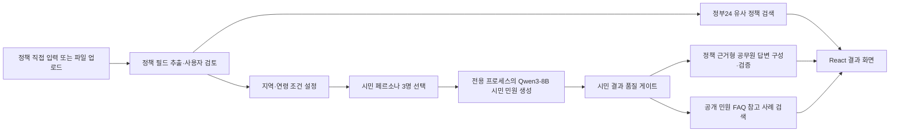

<div align="center">

# CivicEcho

### 정책 시행 전에 합성 시민 페르소나로 예상 민원과 정책 사각지대를 검토하는 로컬 AI 시뮬레이터


**정책 입력 또는 문서 업로드 → 지역·연령 조건 설정 → 시민 페르소나 3명 선택 → 예상 민원·공무원 답변·유사 사례 확인**

</div>

> [!IMPORTANT]
> 이 README는 `main` 브랜치의 2026-08-26 구현 상태를 기준으로 작성했습니다. 현재 제품은 예상 민원과 정책 사각지대를 **정성적으로 검토**하는 도구이며, 과거 프로토타입의 수치형 `risk_score`와 `risk_category`는 현재 API 결과에서 제거되었습니다.

> [!CAUTION]
> 결과는 합성 페르소나와 생성형 AI를 이용한 사전 검토 자료입니다. 실제 시민 모집단의 통계적 예측, 지원 자격 확정, 법률 해석, 행정 처분 또는 특정 집단의 실제 의견을 의미하지 않습니다.

## 목차

- [프로젝트 개요](#프로젝트-개요)
- [현재 구현 범위](#현재-구현-범위)
- [동작 구조](#동작-구조)
- [현재 데이터 스냅샷](#현재-데이터-스냅샷)
- [기술 스택](#기술-스택)
- [실행 요구사항](#실행-요구사항)
- [설치 및 실행](#설치-및-실행)
- [사용 방법](#사용-방법)
- [API](#api)
- [생성 결과 검증과 실패 처리](#생성-결과-검증과-실패-처리)
- [데이터 및 저장소 경계](#데이터-및-저장소-경계)
- [정책·인덱스 갱신](#정책인덱스-갱신)
- [품질 검사](#품질-검사)
- [현재 한계](#현재-한계)
- [라이선스와 데이터 이용](#라이선스와-데이터-이용)

## 프로젝트 개요

기존 민원 분석은 이미 접수된 민원을 분류하고 집계하는 **사후 분석**에 강점이 있습니다. CivicEcho는 정책을 시행하기 전에 서로 다른 지역·연령·직업·생활 배경을 가진 합성 시민이 정책을 어떻게 받아들일지 시뮬레이션하여 다음 문제를 미리 살펴봅니다.

- 지원 대상과 제외 조건이 모호해 자격을 스스로 판단하기 어려운 경우
- 신청 기간, 제출 서류, 신청 채널 또는 문의처가 충분히 설명되지 않은 경우
- 연령 경계 바로 밖의 시민이 형평성 문제를 제기할 수 있는 경우
- 지역 조건과 실제 생활 환경이 충돌해 접근성이 낮아지는 경우
- 정책 문구에 근거하지 않은 행정 답변이 생성되는 경우
- 유사한 정부 정책이나 공개 민원 사례에서 반복되는 질문이 있는 경우

CivicEcho는 정책 담당자가 **정책 원문, 선택한 페르소나, 생성된 민원, 공무원 답변, 유사 정책, 공개 FAQ 참고 사례**를 한 화면에서 연결해 검토하도록 설계되었습니다.

## 현재 구현 범위

| 기능 | 상태 | 현재 구현 |
|---|---:|---|
| 정책 입력 | ✅ | 정책 직접 입력 또는 PDF·DOCX·HWPX·TXT·MD 업로드 |
| 정책 필드 추출 | ✅ | 로컬 Qwen이 정책명, 대상, 기간, 혜택, 제외 조건 등 9개 필드를 추출하고 사용자가 수정 |
| 페르소나 후보 조회 | ✅ | 전국 또는 시·도·시군구와 연령 조건으로 후보 조회 |
| 페르소나 선택 | ✅ | 조건 충족 후보 또는 연령 경계 1년 밖 후보에서 수동 3명 선택, 조건 충족 후보 무작위 3명 선택 |
| 시민 민원 생성 | ✅ | 선택한 시민마다 미리 정한 단일 쟁점의 민원 1개 생성 |
| 공무원 답변 | ✅ | 시민 민원과 정책 필드를 연결해 결정적으로 구성 |
| 품질 검증 | ✅ | 정책 근거, 지역·연령, 페르소나 사실, 숫자·신청 채널, 중복, JSON 구조 검증 |
| 유사 정책 검색 | ✅ | 정부24 정책 Chroma 인덱스에서 유사 정책 검색 |
| 유사 민원 참고 | ✅ | 공개 민원 FAQ Chroma 인덱스에서 참고 가능한 사례 검색 |
| 비동기 작업 | ✅ | `queued`, `running`, `completed`, `failed` 상태와 JSON 작업 파일 |
| 웹 화면 | ✅ | React 기반 정책 입력, 페르소나 선택, 진행 화면, 시민·공무원 대화, 근거 패널 |
| 법령 분석·추천 | ❌ | 현재 제품 범위에서 제외 |
| 수치형 리스크 점수 | ❌ | 폐기된 프로토타입 기능이며 현재 결과 계약에 포함하지 않음 |

## 동작 구조


```mermaid
flowchart LR
    A["정책 직접 입력 또는 파일 업로드"] --> B["정책 필드 추출·사용자 검토"]
    B --> C["지역·연령 조건 설정"]
    C --> D["시민 페르소나 3명 선택"]
    B --> E["정부24 유사 정책 검색"]
    D --> F["전용 프로세스의 Qwen3-8B 시민 민원 생성"]
    F --> G["시민 결과 품질 게이트"]
    G --> H["정책 근거형 공무원 답변 구성·검증"]
    G --> I["공개 민원 FAQ 참고 사례 검색"]
    E --> J["React 결과 화면"]
    H --> J
    I --> J
```

실제 실행 순서는 다음과 같습니다.

1. 사용자가 정책을 직접 입력하거나 정책 문서를 업로드합니다.
2. 파일 입력이면 로컬 LLM이 정책 필드를 추출하고, 사용자가 추출값을 검토·수정합니다.
3. 전국 또는 특정 지역과 최소·최대 연령을 지정합니다.
4. 조건을 충족하는 시민 또는 연령 하한·상한에서 정확히 1년 벗어난 경계 시민 중 3명을 선택합니다. 무작위 모드는 조건 충족 시민만 사용합니다.
5. Qwen3-8B가 시민마다 민원 1개를 생성하고, 서버가 정책·페르소나 근거를 검증합니다.
6. 서버가 같은 민원 쟁점을 정책 원문과 연결해 공무원 답변을 구성하고 다시 검증합니다.
7. 정부24 유사 정책과 공개 FAQ 참고 사례를 연결합니다.
8. 시민 3명과 공무원 답변 3개가 모두 검증된 경우에만 완료 결과를 표시합니다.

## 현재 데이터 스냅샷

| 자산 | 저장소 기준 시점 | 규모·버전 | 용도 |
|---|---|---:|---|
| 정부24 대한민국 공공서비스(혜택) 정보 | 2026-08-25 수집 | 정책 10,961건 | 입력 정책과 유사한 정부 정책 검색 |
| 공개 민원 FAQ 스냅샷 | 2026-08-26 인덱스 생성 | 원본 2,168건, 중복 제거 1,344건 | 생성 민원과 참고 가능한 공개 사례 연결 |
| Nemotron-Personas-Korea | 최초 요청 시 다운로드 | `refs/convert/parquet` 리비전 | 시민·공무원 합성 페르소나 |
| 정책·민원 임베딩 | 현재 활성 인덱스 | `snunlp/KR-SBERT-V40K-klueNLI-augSTS`, 768차원, 최대 512토큰 | ChromaDB 의미 유사도 검색 |

데이터 시점과 건수는 저장소의 활성 인덱스 manifest를 기준으로 하며, manifest의 시간값은 UTC입니다.

## 기술 스택

| 영역 | 기술 |
|---|---|
| 백엔드 | Python 3.12 이상, FastAPI, Pydantic, Uvicorn |
| 로컬 생성 모델 | `Qwen/Qwen3-8B`, Transformers 5.12.1, PyTorch 2.12.1, Accelerate 1.14.0 |
| 생성 방식 | Thinking 비활성화, `do_sample=False` 결정적 생성, 최대 1,024 새 토큰 |
| 검색 | ChromaDB 1.5.9, Sentence Transformers 5.6.1, KR-SBERT |
| 데이터 처리 | pandas 3.0.3, PyArrow 24.0.0 |
| 문서 처리 | pypdf 6.15.0, python-docx 1.2.0, HWPX XML 파서 |
| 프런트엔드 | React 19.2.8, React Router 7.18.2, Vite 8.2.0, Tailwind CSS 4.3.3 |
| 정적 검사 | Python `compileall`, unittest, OXLint, Vite build, 제출 경계 검증 스크립트 |

## 실행 요구사항

- Python 3.12 이상
- Node.js 20.19.0 이상 또는 22.12.0 이상
- Git
- 최신 Chromium 기반 Chrome
- 최초 모델·임베딩·페르소나 다운로드를 위한 네트워크 연결
- Hugging Face 캐시와 런타임 파일을 저장할 충분한 디스크 공간
- 로컬 Qwen3-8B 실행을 위한 CUDA GPU 권장

> [!NOTE]
> 현재 CUDA 경로는 Qwen3-8B BF16 원본 가중치를 `device_map="auto"`로 배치하며, 코드에 GPU 9GiB와 CPU 22GiB의 메모리 상한이 설정되어 있습니다. 이는 개발 환경에 맞춘 값입니다. MPS와 CPU 경로도 존재하지만 전체 모델을 단일 장치로 이동하므로 메모리 부족 또는 매우 느린 실행이 발생할 수 있습니다.

## 설치 및 실행

### 1. 저장소 복제

```bash
git clone https://github.com/dev-samuel-codes/policy_risk_persona_simulator.git
cd policy_risk_persona_simulator
```

### 2. 백엔드 설치

macOS 또는 Linux:

```bash
python3.12 -m venv .venv
source .venv/bin/activate
python -m pip install --upgrade pip
python -m pip install -e .
```

Windows PowerShell:

```powershell
py -3.12 -m venv .venv
.venv\Scripts\Activate.ps1
python -m pip install --upgrade pip
python -m pip install -e .
```

### 3. 프런트엔드 설치

```bash
cd frontend
npm ci
cd ..
```

### 4. 개발 서버 실행

터미널 1에서 백엔드를 실행합니다.

```bash
source .venv/bin/activate
uvicorn backend.api:app --host 127.0.0.1 --port 8000
```

Windows에서는 `source` 대신 `.venv\Scripts\Activate.ps1`을 사용합니다.

터미널 2에서 프런트엔드를 실행합니다.

```bash
cd frontend
npm run dev -- --host 127.0.0.1 --port 5173
```

브라우저에서 다음 주소를 엽니다.

- 웹 애플리케이션: `http://127.0.0.1:5173`
- FastAPI 문서: `http://127.0.0.1:8000/docs`

상태 확인:

```bash
curl -f http://127.0.0.1:8000/api/health
curl -f http://127.0.0.1:5173/api/health
```

Vite 개발 서버는 `/api` 요청을 `http://127.0.0.1:8000`으로 프록시합니다.

### 최초 실행 시 준비되는 자산

- 첫 페르소나 옵션·후보 요청에서 `nvidia/Nemotron-Personas-Korea` Parquet을 `data/raw/personas/`에 다운로드합니다.
- 첫 정책 필드 추출 또는 시뮬레이션에서 `Qwen/Qwen3-8B`를 Hugging Face 캐시에 다운로드합니다.
- 첫 유사도 검색에서 필요한 KR-SBERT 모델이 캐시에 없으면 다운로드합니다.
- 정책·민원 Chroma 인덱스 본체와 manifest는 저장소에 포함되어 있습니다.
- 일반적인 시뮬레이션 실행에는 환경변수가 필요하지 않습니다.

## 사용 방법

```text
/policy
  → 정책 직접 입력 또는 파일 업로드
  → 추출된 정책 필드 검토
  → 전국·지역 및 연령 조건 설정
  → 시민 페르소나 3명 수동 선택 또는 무작위 선택
  → 시뮬레이션 제출
  → queued/running 상태 확인
  → 시민 민원·공무원 답변·유사 정책·공개 FAQ 참고 사례 확인
```

정책 직접 입력에서 필수인 값은 `policy_name`과 `benefits`입니다. 나머지 필드가 비어 있으면 시스템은 값을 추측해 확정하지 않습니다.

### 지원 정책 파일

| 형식 | 확장자 |
|---|---|
| PDF | `.pdf` |
| Word | `.docx` |
| 한글 XML 문서 | `.hwpx` |
| 텍스트 | `.txt` |
| Markdown | `.md` |

- 파일당 최대 크기는 15MB입니다.
- LLM 필드 추출에 전달되는 원문은 최대 8,000자입니다.
- 이미지 OCR은 수행하지 않으므로 텍스트 계층이 없는 스캔 PDF는 추출할 수 없습니다.
- 구형 바이너리 `.hwp`는 지원하지 않습니다.
- 업로드 단계에서는 추출값을 저장하거나 활성 정책을 변경하지 않습니다.
- 사용자가 추출값과 지역·연령 조건, 페르소나를 확정해 시뮬레이션을 제출할 때만 활성 정책과 작업 파일을 저장합니다.

## API

| 메서드 | 경로 | 용도 |
|---|---|---|
| GET | `/api/health` | 서버 상태 |
| GET | `/api/personas/options` | 시·도와 시군구 선택지 |
| GET | `/api/personas/candidates` | 지역·연령·코호트 조건에 맞는 페르소나 후보 |
| GET | `/api/policies/active` | 현재 활성 정책 |
| POST | `/api/policies/extract-file` | 정책 파일의 9개 필드 추출 |
| POST | `/api/policies/similar` | 입력 정책과 유사한 정부24 정책 검색 |
| POST | `/api/policies/direct` | 이전 호출자용 deprecated 호환 경로 |
| POST | `/api/simulations` | 페르소나 선택을 포함한 시뮬레이션 작업 생성 |
| GET | `/api/simulations/{job_id}` | 작업 상태와 완료·실패 결과 조회 |

`POST /api/simulations`의 수동 모드는 서로 다른 페르소나 ID 3개를 요구합니다. 무작위 모드는 전달된 지역·연령 조건을 충족하는 시민 3명을 서버에서 선택합니다.

작업 상태는 다음 계약을 사용합니다.

```text
queued → running → completed
                 ↘ failed
```

작업 상태와 결과는 `data/runtime/simulations/<job_id>.json`에 원자적으로 저장됩니다.

## 생성 결과 검증과 실패 처리

시민 결과는 다음 항목을 검사합니다.

- 구조화 JSON과 필수 필드
- 한국어 문장과 단일 쟁점 일관성
- 정책 원문에 존재하는 근거
- 선택한 시민의 UUID·지역·연령·페르소나 사실
- 숫자, 날짜, 신청 채널, 제출 서류, 문의처의 근거
- 시민 간 중복 민원
- 생성 결과와 API 요청 순서의 정합성

공무원 답변은 자유로운 추가 정책 설명을 생성하지 않습니다. 시민 민원의 단일 쟁점과 입력된 정책 필드를 연결해 구성하며, 입력에 없는 자격·승인·기한·서류·문의처를 확정하지 않습니다.

실패 처리는 부분 성공보다 정합성을 우선합니다.

- 민원 하나라도 검증에 실패하면 해당 시민 응답 전체를 최대 3회 다시 생성합니다.
- 현재 생성 계약은 시민 1명마다 민원 정확히 1개입니다.
- 검증에 실패한 민원만 삭제해 축약 결과를 통과시키지 않습니다.
- 시민 또는 공무원 결과 하나라도 최종 검증에 실패하면 작업 전체를 `failed`로 처리합니다.
- 실패 작업에는 부분 결과를 노출하지 않습니다.
- 특정한 민원 유형이 나오지 않았다는 이유만으로 결과를 임의 재생성하지 않습니다.
- 파이프라인 종료 시 전용 LLM 프로세스를 종료해 CUDA 컨텍스트와 VRAM을 반환합니다.

## 데이터 및 저장소 경계

### 저장소에 포함하는 제품 자산

```text
data/raw/policies/
data/raw/faq/civil_policy_qna_detail.json
data/raw/faq/civil_policy_qna_metadata.json
data/indexes/policies/current/
data/indexes/civil_complaints/current/active.json
data/indexes/civil_complaints/versions/<active-version>/
```

### 실행 중 생성되거나 외부에서 내려받는 자산

```text
data/raw/personas/
data/runtime/
.venv/
frontend/node_modules/
frontend/dist/
tmp/
```

페르소나 Parquet, 모델 캐시, 시뮬레이션 작업 파일은 Git에 포함하지 않습니다. 연구용 법령 원천, 학습 체크포인트, 실험 출력, 구형 RAG 프로토타입과 폐기된 점수 계산 코드는 제품 실행 경계에서 제외했습니다.

### 저장소 구조

```text
backend/
  api.py                               FastAPI 앱과 작업 API
  ai_simulation_core/
    llm/                               Qwen 전용 프로세스와 모델 로더
    personas/                          페르소나 다운로드·필터·선택
    policies/                          정책 저장소·문서 추출·유사도 검색
    simulations/                       시민 생성·품질 게이트·공무원 답변
    complaints/                        공개 민원 코퍼스·유사 사례 검색
  tests/                               백엔드 회귀 테스트

frontend/
  src/
    pages/                             홈·정책 분석·소개 화면
    components/policy/                 페르소나 선택·민원 근거 UI

data/
  raw/policies/                        정부24 정책 원천
  raw/faq/                             공개 민원 FAQ 원천
  indexes/policies/current/            활성 정책 검색 인덱스
  indexes/civil_complaints/            버전형 민원 검색 인덱스
  runtime/                             활성 정책과 시뮬레이션 작업

scripts/
  data/                                정부24 정책 원천 갱신
  rag/                                 정책·민원 인덱스 생성
  verify_submission.py                 제출 경계·활성 인덱스 무결성 검사
```

## 정책·인덱스 갱신

일반적인 서비스 실행에는 인증키가 필요하지 않습니다. 정부24 정책 원천을 다시 수집할 때만 공공데이터포털 인증키가 필요합니다.

```bash
cp .env.example .env
# .env의 GOV24_OPENAPI_SERVICE_KEY 값을 입력합니다.

source .venv/bin/activate
python scripts/data/fetch_gov24_policy_openapi.py --dry-run
python scripts/data/fetch_gov24_policy_openapi.py
python scripts/rag/build_policy_index.py
```

공개 민원 FAQ 원천을 변경한 경우 민원 인덱스도 다시 생성합니다.

```bash
python scripts/rag/build_civil_complaint_index.py
```

두 인덱스 빌더는 새 인덱스와 manifest를 검증한 뒤 활성 경로를 원자적으로 전환합니다. 갱신 후 제출 경계 검사와 전체 테스트를 통과한 다음 이전 백업·비활성 버전을 프로젝트 밖으로 이동합니다.

## 품질 검사

백엔드 회귀 테스트:

```bash
source .venv/bin/activate
python -m unittest discover -s backend/tests -p 'test_*.py' -v
```

Python 구문과 Git 패치 공백 검사:

```bash
python -m compileall -q backend scripts
git diff --check
```

프런트엔드 정적 검사와 프로덕션 빌드:

```bash
cd frontend
npm run lint
npm run build
cd ..
```

제출본의 필수 파일, 금지 경로, 정책 원천 해시, 활성 Chroma 인덱스와 페르소나 전달 방식을 검사합니다.

```bash
python scripts/verify_submission.py
```

최종 실기 검증은 같은 최종 소스 상태에서 실제 Qwen 시뮬레이션을 반복 실행해 시민·공무원 결과, 근거 게이트, 인덱스 검색과 GPU 해제까지 확인해야 합니다.

## 현재 한계

- 시뮬레이션 작업은 FastAPI 프로세스 내부의 단일 작업 스레드에서 순차 처리합니다. 분산 큐나 다중 서버 실행을 지원하지 않습니다.
- 작업 상태는 로컬 JSON 파일에 저장하며 사용자 계정, 인증, 권한, 데이터베이스가 없습니다.
- 파이프라인이 끝나면 모델 프로세스를 종료하므로 다음 시뮬레이션에서 모델 로딩 시간이 다시 발생합니다.
- 시민 후보의 정책 적합성 필터는 현재 지역과 데이터셋 연령만 사용합니다. 소득, 재산, 가구, 장애, 서류 요건 전체를 판정하지 않습니다.
- 연령 경계 코호트는 정책 하한보다 1세 낮거나 상한보다 1세 높은 시민만 포함합니다.
- 업로드 문서의 표, 도형, 이미지, 복잡한 레이아웃과 OCR 품질을 보장하지 않습니다.
- 공개 FAQ 검색은 참고 기능이며 검색 장애가 발생해도 시민 시뮬레이션 자체는 계속될 수 있습니다.
- 생성 결과는 실제 모집단의 빈도, 지지율, 민원 건수 또는 정책 성과를 추정하지 않습니다.

## 라이선스와 데이터 이용

- Pretendard GOV 폰트 라이선스는 `frontend/src/assets/fonts/LICENSE.md`에 포함되어 있습니다.
- 프로젝트 전체 배포 라이선스는 아직 저장소에 명시되지 않았습니다.
- Qwen 모델, Nemotron-Personas-Korea, KR-SBERT, 정부24 원천과 공개 FAQ는 각 제공처의 이용 조건과 라이선스를 별도로 확인해야 합니다.
- 실제 운영에 사용하기 전에는 개인정보, 행정 의사결정, 모델 편향, 데이터 최신성 및 책임 소재를 별도로 검토해야 합니다.
