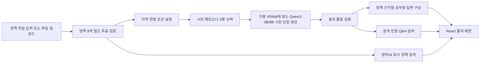

<div align="center">

# CivicEcho

### 정책 시행 전에 합성 시민 페르소나로 예상 민원과 정책 사각지대를 살펴보는 로컬 AI 시뮬레이터


[](LICENSE)

**정책 입력 또는 문서 업로드 → 지역·연령 조건 설정 → 시민 페르소나 3명 선택 → 예상 민원·공무원 답변·유사 사례 확인**

</div>

## 프로젝트 소개

CivicEcho는 정책을 시행하기 전에 여러 시민의 입장에서 어떤 질문과 민원이 나올지 미리 살펴보는 도구입니다. 실제 개인정보 대신 `nvidia/Nemotron-Personas-Korea`의 합성 페르소나를 사용하고, 생성과 검색은 로컬 공개 모델로 처리합니다.

정책 담당자는 정책 원문, 선택한 시민 페르소나, 생성된 민원, 공무원 답변, 유사 정책과 공개 민원 Q&A 참고 사례를 한 화면에서 함께 확인할 수 있습니다. 결과는 정책 문구와 신청 절차를 검토하기 위한 참고자료로 사용합니다.

| 항목 | 내용 |
|---|---|
| 대회 | 2026년 오픈소스 개발자대회 |
| 참가 부문 | 학생 자유과제 |
| 팀명·인원 | CivicEcho·3명 |
| 프로젝트명 | Nemotron 기반 정책 민원 예측 시뮬레이터 |
| AI 활용 유형 | 외부 공개 모델을 추가 학습 없이 연동·구동 |

## 주요 기능

| 기능 | 내용 |
|---|---|
| 정책 입력 | 정책을 직접 입력하거나 PDF·DOCX·HWPX·TXT·MD 파일 업로드 |
| 정책 필드 추출 | 정책명, 대상, 기간, 혜택, 제외 조건 등 9개 필드를 추출하고 사용자가 수정 |
| 페르소나 조회 | 전국·시도·시군구와 연령 조건으로 시민 후보 조회 |
| 페르소나 선택 | 조건 충족 시민 또는 연령 경계 시민 중 3명 수동 선택, 조건 충족 시민 3명 무작위 선택 |
| 시민 민원 생성 | 선택한 시민마다 정책과 페르소나에 맞는 민원 1개 생성 |
| 공무원 답변 | 생성된 민원의 쟁점과 입력 정책을 연결한 답변 구성 |
| 결과 검증 | 정책 근거, 지역·연령, 페르소나 사실, 숫자·신청 채널, 중복과 JSON 구조 확인 |
| 유사 정책 검색 | 정부24 정책 인덱스에서 입력 정책과 유사한 정책 검색 |
| 공개 Q&A 참고 | 공개 민원 FAQ 인덱스에서 관련 사례 검색 |
| 작업 상태 관리 | `queued`, `running`, `completed`, `failed` 상태와 JSON 결과 파일 관리 |
| 웹 화면 | 정책 입력부터 페르소나 선택, 진행 상태, 시민·공무원 대화와 참고자료까지 표시 |

## 동작 흐름


```mermaid
flowchart LR
    A["정책 직접 입력 또는 파일 업로드"] --> B["정책 9개 필드 추출·검토"]
    B --> C["지역·연령 조건 설정"]
    C --> D["시민 페르소나 3명 선택"]
    D --> E["가용 VRAM에 맞는 Qwen3-4B/8B 시민 민원 생성"]
    E --> F["결과 품질 검증"]
    F --> G["정책 근거형 공무원 답변 구성"]
    B --> H["정부24 유사 정책 검색"]
    F --> I["공개 민원 Q&A 검색"]
    G --> J["React 결과 화면"]
    H --> J
    I --> J
```

1. 정책을 직접 입력하거나 정책 문서를 업로드합니다.
2. 파일을 올린 경우 Qwen이 9개 정책 필드를 추출합니다.
3. 추출된 값을 검토하고 지역·연령 조건을 설정합니다.
4. 조건에 맞는 시민 또는 연령 경계 시민 중 3명을 선택합니다.
5. 서버가 정책, 선택 조건과 페르소나 ID를 다시 확인한 뒤 작업을 생성합니다.
6. 가용 VRAM에 따라 선택된 Qwen3-4B 또는 8B가 시민별 민원을 생성하고 서버가 정책·페르소나 근거를 확인합니다.
7. 같은 민원 쟁점을 기준으로 공무원 답변과 검색 참고자료를 연결합니다.
8. 시민 3명과 연결된 결과가 모두 검증되면 결과 화면에 표시합니다.

## 모델과 데이터

| 역할 | 모델·데이터 | 사용 방식 |
|---|---|---|
| 정책 필드 추출·시민 민원 생성 | `Qwen/Qwen3-4B-Instruct-2507`, `Qwen/Qwen3-8B` | 실행 시 가용 CUDA VRAM만으로 자동 선택 |
| 정책·민원 임베딩 | `snunlp/KR-SBERT-V40K-klueNLI-augSTS` | ChromaDB 의미 유사도 검색 |
| 시민 페르소나 | `nvidia/Nemotron-Personas-Korea` | 지역·연령·직업 등 합성 시민 정보 |
| 유사 정책 | 정부24 공공서비스 정보 | 입력 정책과 유사한 정부 정책 검색 |
| 공개 Q&A | 공개 민원 FAQ | 생성 민원과 관련된 참고 사례 검색 |

실행 직전에 CUDA의 가용 VRAM을 확인해 생성 모델을 선택합니다. RAM과 CPU 사양은 모델 전환 기준에 포함하지 않습니다.

> [!TIP]
> 가용 CUDA VRAM이 24GiB 이상이면 8B, 그보다 적거나 CUDA VRAM을 확인할 수 없는 Apple MPS·CPU 환경이면 4B를 선택합니다. 자동 선택을 재정의하려면 `QWEN_MODEL_NAME` 환경변수에 원하는 Hugging Face 모델 ID를 지정하세요.

## 실행 환경

- Python 3.12 이상
- Node.js 20.19.0 이상 또는 22.12.0 이상
- Git
- 최초 모델·임베딩·페르소나 다운로드를 위한 네트워크 연결
- 로컬 모델 실행을 위한 CUDA GPU 권장

## 설치 및 실행

### 1. 저장소 복제

```bash
git clone https://github.com/dev-samuel-codes/policy_risk_persona_simulator.git
cd policy_risk_persona_simulator
```

### 2. 백엔드 설치

```bash
python3.12 -m venv .venv
source .venv/bin/activate
python -m pip install --upgrade pip
python -m pip install -e .
```

### 3. 프런트엔드 설치

```bash
cd frontend
npm ci
cd ..
```

### 4. 개발 서버 실행

터미널 1에서 백엔드를 실행합니다.

```bash
source .venv/bin/activate
uvicorn backend.api:app --host 127.0.0.1 --port 8000
```

터미널 2에서 프런트엔드를 실행합니다.

```bash
cd frontend
npm run dev -- --host 127.0.0.1 --port 5173
```

- 웹 애플리케이션: `http://127.0.0.1:5173`
- FastAPI 문서: `http://127.0.0.1:8000/docs`

상태 확인:

```bash
curl -f http://127.0.0.1:8000/api/health
curl -f http://127.0.0.1:5173/api/health
```

Vite 개발 서버는 `/api` 요청을 `http://127.0.0.1:8000`으로 전달합니다.

### 최초 실행 시 준비되는 파일

- 첫 페르소나 조회에서 Nemotron 페르소나 데이터를 `data/raw/personas/`에 내려받습니다.
- 첫 정책 필드 추출 또는 시뮬레이션에서 자동 선택된 Qwen 4B 또는 8B를 Hugging Face 캐시에 내려받습니다.
- 첫 유사도 검색에서 KR-SBERT 모델을 내려받습니다.
- 정책·민원 Chroma 인덱스와 manifest는 저장소에 포함되어 있습니다.

## 사용 방법

```text
/policy
  → 정책 직접 입력 또는 파일 업로드
  → 추출된 정책 필드 검토
  → 전국·지역 및 연령 조건 설정
  → 시민 페르소나 3명 수동 선택 또는 무작위 선택
  → 시뮬레이션 제출
  → 진행 상태 확인
  → 시민 민원·공무원 답변·유사 정책·공개 Q&A 참고 사례 확인
```

정책 직접 입력에서는 `policy_name`과 `benefits`를 필수로 입력합니다.

### 지원 파일

| 형식 | 확장자 |
|---|---|
| PDF | `.pdf` |
| Word | `.docx` |
| 한글 XML 문서 | `.hwpx` |
| 텍스트 | `.txt` |
| Markdown | `.md` |

파일당 최대 크기는 15MB이며, 정책 필드 추출에는 원문 최대 8,000자를 사용합니다. 추출된 값은 화면에서 확인하고 수정할 수 있습니다.

## API

| 메서드 | 경로 | 용도 |
|---|---|---|
| GET | `/api/health` | 서버 상태 확인 |
| GET | `/api/personas/options` | 시도·시군구 선택지 조회 |
| GET | `/api/personas/candidates` | 지역·연령·코호트 조건에 맞는 페르소나 조회 |
| GET | `/api/policies/active` | 현재 활성 정책 조회 |
| POST | `/api/policies/extract-file` | 정책 파일에서 9개 필드 추출 |
| POST | `/api/policies/similar` | 입력 정책과 유사한 정부24 정책 검색 |
| POST | `/api/policies/direct` | 정책 직접 입력 호환 경로 |
| POST | `/api/simulations` | 페르소나 선택을 포함한 시뮬레이션 작업 생성 |
| GET | `/api/simulations/{job_id}` | 작업 상태와 결과 조회 |

수동 모드는 서로 다른 페르소나 ID 3개를 전달합니다. 무작위 모드는 지역·연령 조건에 맞는 시민 3명을 서버에서 선택합니다.

작업 상태와 결과는 `data/runtime/simulations/<job_id>.json`에 저장됩니다.

## 프로젝트 구조

```text
backend/
  api.py                               FastAPI 앱과 작업 API
  ai_simulation_core/
    llm/                               Qwen 모델 로더와 전용 프로세스
    personas/                          페르소나 다운로드·필터·선택
    policies/                          정책 저장·문서 추출·유사도 검색
    simulations/                       시민 생성·검증·공무원 답변
    complaints/                        공개 민원 코퍼스·유사 사례 검색
  tests/                               백엔드 회귀 테스트

frontend/
  src/
    pages/                             홈·정책 분석·소개 화면
    components/policy/                 페르소나 선택·민원 근거 UI

data/
  raw/policies/                        정부24 정책 원천
  raw/faq/                             공개 민원 FAQ 원천
  indexes/policies/current/            활성 정책 검색 인덱스
  indexes/civil_complaints/            민원 검색 인덱스
  runtime/                             활성 정책과 시뮬레이션 작업

scripts/
  data/                                정부24 정책 원천 갱신
  rag/                                 정책·민원 인덱스 생성
  verify_submission.py                 제출 파일과 인덱스 무결성 검사
```

## 데이터 갱신

일반적인 실행에는 인증키가 필요하지 않습니다. 정부24 정책 원천을 다시 수집할 때는 `.env`에 `GOV24_OPENAPI_SERVICE_KEY`를 설정합니다.

```bash
cp .env.example .env

source .venv/bin/activate
python scripts/data/fetch_gov24_policy_openapi.py --dry-run
python scripts/data/fetch_gov24_policy_openapi.py
python scripts/rag/build_policy_index.py
```

공개 민원 FAQ 원천을 변경한 뒤에는 민원 인덱스를 다시 생성합니다.

```bash
python scripts/rag/build_civil_complaint_index.py
```

## 품질 검사

백엔드 테스트와 Python 구문 검사:

```bash
source .venv/bin/activate
python -m unittest discover -s backend/tests -p 'test_*.py' -v
python -m compileall -q backend scripts
```

프런트엔드 정적 검사와 빌드:

```bash
cd frontend
npm run lint
npm run build
cd ..
```

Git 패치와 제출 파일 검사:

```bash
git diff --check
python scripts/verify_submission.py
```

## 라이선스

이 저장소에서 직접 작성한 프로젝트 코드는 [Apache License 2.0](LICENSE)에 따라 배포합니다.

모델·데이터·폰트 등 외부 자산은 각 제공처의 라이선스 조건을 따릅니다.
